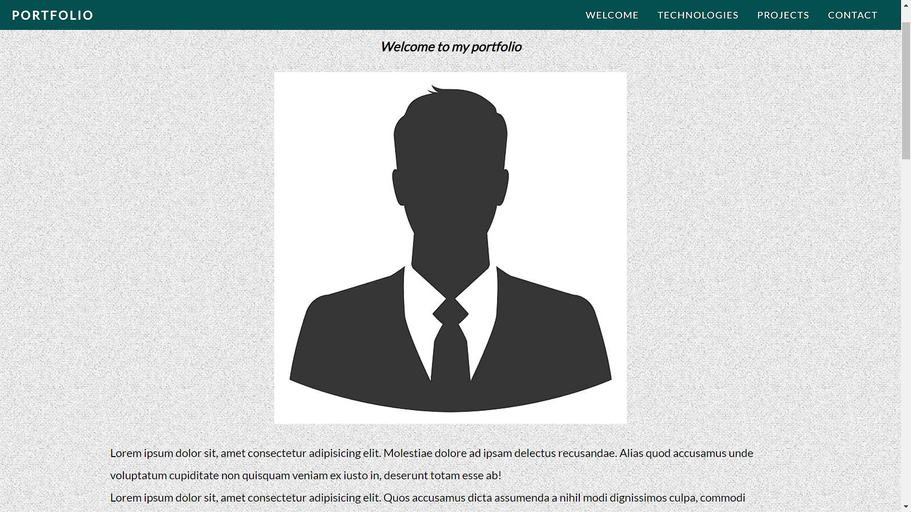
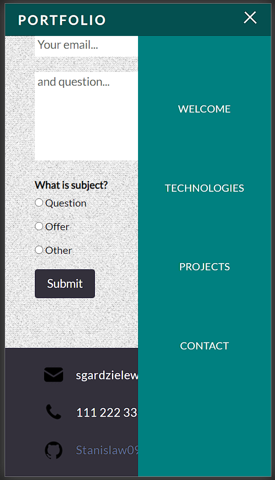
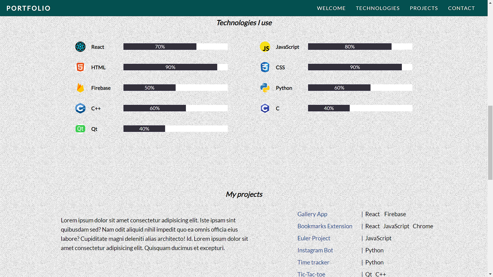
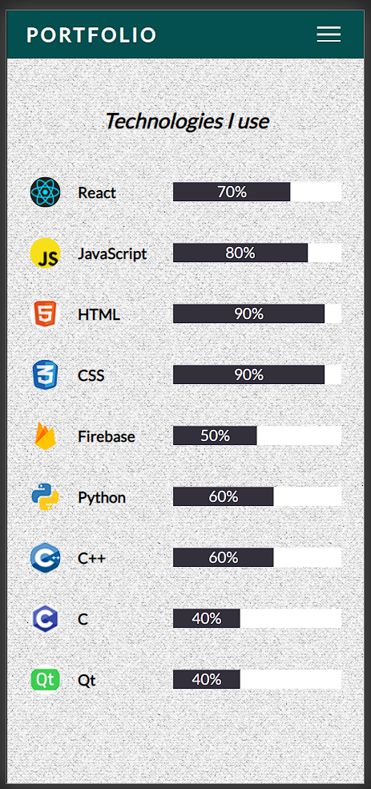
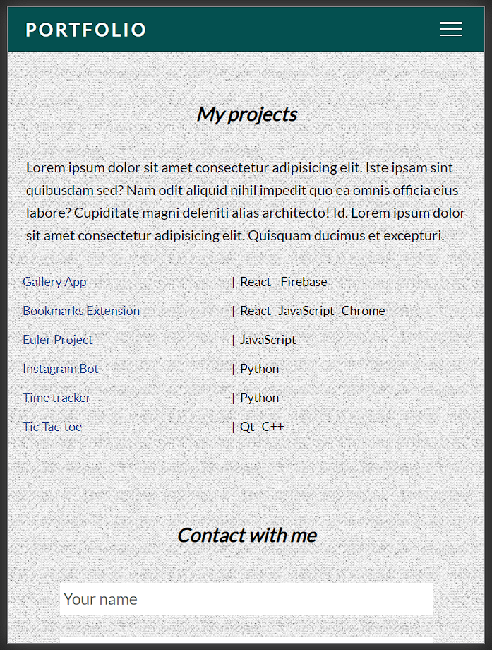

# Portfolio website

---

Simple business card / portfolio created of web developer in the form of static web page created with plain HTML and CSS

Preview:
https://stanislaw09.github.io/camp-portfolio/

---

### Aim and functionality

Page has been divided into a few man sections in order to present main skills and experience of person

* **Welcome** section with photo and description of person, his scope of knowledge, level of experience and some additional not work-related information
* **Technologies** is the form of grid which represents the technologies one knows and the level of mastery
* **Projects** contains short description about previous projects, technologies used to build them and links to GitHub repos
* **Contact** provides short contact form with the required fields like name, email, main purpose of message
* **Footer** which contains basic ways of contact

---

Portfolio includes such concepts like:

- flexboxes implemented as the responsive navbar:

- responsive grids to present known technologies and projects:

  

* key frames included in mobile navbar transition

* media query to provide responsive view regardless of screen view

  ---

  

### Technologies

* HTML 5
* CSS 3
